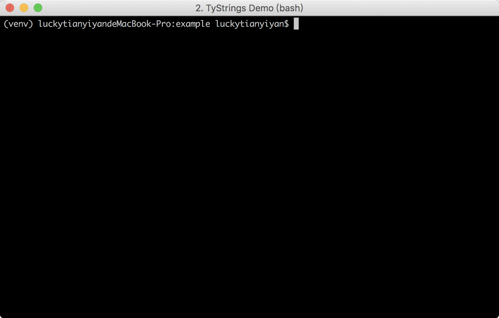

.. code-block::

  _______     _____ _        _
 |__   __|   / ____| |      (_)
    | |_   _| (___ | |_ _ __ _ _ __   __ _ ___
    | | | | |\___ \| __| '__| | '_ \ / _` / __|
    | | |_| |____) | |_| |  | | | | | (_| \__ \
    |_|\__, |_____/ \__|_|  |_|_| |_|\__, |___/
        __/ |                         __/ |
       |___/                         |___/

strings file tool for iOS / macOS developers

|pypi| |build| |coverage| |license|

|screenshot|

Installation
============

.. code-block:: bash

  $ sudo pip install tystrings

Usage
-------
.. code-block:: bash

  $ tystrings -h
    usage: tystrings [-h] [--version] {generate,translate,lint,diff} ...

     _______     _____ _        _
    |__   __|   / ____| |      (_)
      | |_   _| (___ | |_ _ __ _ _ __   __ _ ___
      | | | | |\___ \| __| '__| | '_ \ / _` / __|
      | | |_| |____) | |_| |  | | | | | (_| \__ \
      |_|\__, |_____/ \__|_|  |_|_| |_|\__, |___/
          __/ |                         __/ |
         |___/                         |___/

    optional arguments:
    -h, --help            show this help message and exit
    --version             show program's version number and exit

    subcommands:
    {generate,translate,lint,diff}
      generate            generate `.strings` file from source code files.
      translate           using Baidu Translate Service to translate `.strings`
                          file.
      lint                Validates a `.strings` file.
      diff                Compare `.strings` files line by line.

To run `tystrings generate` over all .m files in your project, you can invoke it, for example, like this:

.. code-block:: bash

  $ tystrings generate $(find . -name \*.m) -o en.lproj zh-Hans.lprog -v

translate `.strings` file to another language:

.. code-block:: bash

  $ tystrings translate en.lproj/Localizable.strings zh-Hans.lproj/Localizable.strings --src-lang en --dst-lang zh

validates `.strings` file:

.. code-block:: bash

  $ tystrings lint en.lproj/Localizable.strings

compare two `.strings` files:

.. code-block:: bash

  $ tystrings diff Localizable1.strings Localizable2.strings

.. |pypi| image:: https://img.shields.io/pypi/v/TyStrings.svg?maxAge=2592000
   :target: https://pypi.python.org/pypi/TyStrings
   :alt: Python Package Index

.. |license| image:: https://img.shields.io/github/license/luckytianyiyan/TyStrings.svg?maxAge=2592000
   :target: LICENSE
   :alt: MIT License

.. |build| image:: https://img.shields.io/travis/luckytianyiyan/TyStrings.svg?maxAge=2592000
   :target: https://travis-ci.org/luckytianyiyan/TyStrings
   :alt: Continuous Integration

.. |coverage| image:: https://coveralls.io/repos/github/luckytianyiyan/TyStrings/badge.svg
   :target: https://coveralls.io/github/luckytianyiyan/TyStrings
   :alt: Coverage Testing Results

